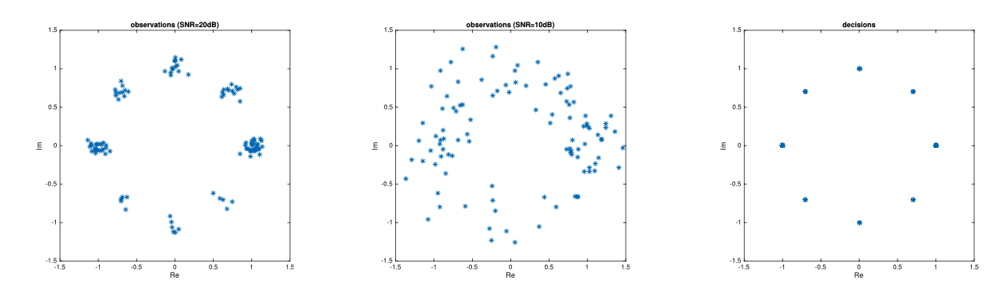
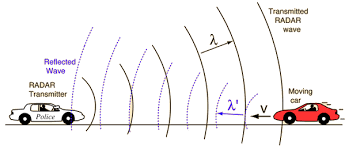
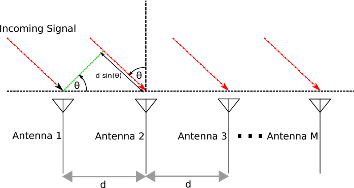
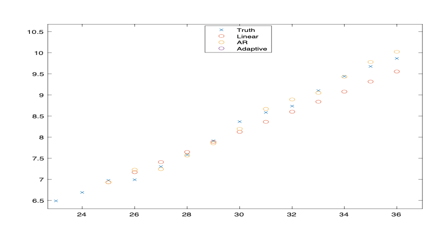
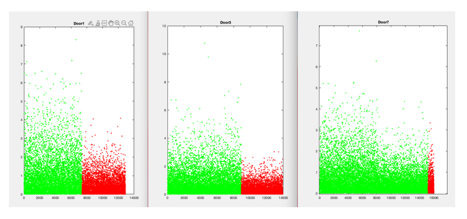

# Statistical Inference

The matlab scripts in this repository were part of assignments from EECE 5612 Statistical Inference Spring 2022 with [Dr. Milica Stojanovic](https://coe.northeastern.edu/people/stojanovic-milica/). The overall goal of these programs are to extract information from noisy signals, and classify data
using various decision rules and hypothesis testing. Source code and writeups for each problem can be found in their respective folder.

### HW1

This script simulates the signal absent or present  in gaussian noise scenario, where the Maximum Likelihood [(ML)](https://hkn.illinois.edu/wiki/wiki:fundamental_mathematics:hypothesis_testing#:~:text=Maximum%20Likelihood%20Decision%20Rule,-Now%20that%20you&text=There%20is%20a%20pattern%20for,is%20H0(or%20H1).) decision rule is used to determine if the given observation is noise or a signal based on the known SNR (signal to noise ratio). 10,000 trials were run for 16 SNR values ranging from 0 to 15 and the truth labels were used to calculate the probability of error, false positive, and false negative. 

### HW2

This assignment builds on the signal absent or present scenario from HW1. First, the signal is known to be not constant but instead a random gaussian variable. Next, the signal is again constant but the noise is laplacian instead of gaussian. Finally, the prior probabilities of the signal being absent or present are given and used to make a Maximum A-Posteriori [(MAP)](https://machinelearningmastery.com/maximum-a-posteriori-estimation/#:~:text=Maximum%20a%20Posteriori%20estimation%20is,or%20belief%20about%20the%20model.) decision. 

### HW3

In this scenario, the Neyman-Pearson detection principle [(NP)](https://cnx.org/contents/aOvnYzjq@1.9:7yMVBb6e@2/The-Neyman-Pearson-Criterion#:~:text=The%20Neyman%2DPearson%20Lemma%3A%20General%20Case&text=is%20the%20most%20powerful%20test,%E2%84%8B0%20and%20%E2%84%8B1.) is utilized to make a decision on the scenario where a signal in Gaussian noise is known be either the constant A0 or the consant A1 > A0. The SNR of A0 is set to 10 and the SNR of A1 is set to 15. With NP detection, a prior theoretical probability of false alarm is assigned and the decision threshold is chose to be the value at which the probability of correct detection is maximized.

### HW4

This assignment experimented with Phase Shift Keying [(PSK)](https://en.wikipedia.org/wiki/Phase-shift_keying) - a technique used to communicate information by modulating the signal phase. Using an 8-PSK where each phase represents a 3bit binary number that represents a letter of the english alphabet, an encoded message was sent using 8-PSK with gaussian noise. The message was decoded to read "PLANET E RTH IS BLUE AND THERE IS OTXING I CAN DO"

### HW5 - Midterm

In this problem, a noisy greyscale image given under the assumption that the original image contains only black or white pixles (0 or 255). To denoise the image, a window of variable size around each pixel is considered as a multiple observation for the value of the center pixel. The best window size from experimentation was found to be one with diameter of 29. 

### HW6

In this scenario, a recording is known to contain a clip of a sinc pulse however its delay within the recording is not known. The delay is found using ML estimation, which ends up being the index of the maximum auto cross correlation between the known signal and the given recording. 

### HW6a

This problem simulates a "radar gun" scenario, where a known Barker sequence pulse is transmitted off of a moving object. The sequence is modulated in-phase and quadrature on to a carrier frequency of 20 GHz where each square pulse has a duration of 0.4 ms. The relative speed and direction of the moving object is calculated by estimating the Doppler frequency offset.

### HW7

This problem shows how an array of sensors can be used to determine the angle of arrival of a noisy signal. Given the speed of the signal and the distance between each sensor in the array, the difference in phase can be used to detemrine the angle of arrivel. The scenario is visualized by the image below.

### HW9

This problem uses an autoregressive model to perform stock price forcasting. Given a time series of stock price, the first 24 values are used to generate the model and are compared to the labeled values from 24 to 36. Then, an adaptive LMS was used to generate on the fly forcasting. Results can be seen below

### HW10 - Detectathon

In this scenario, cameras are placed over 10 doors in an airport and every time it detects a person pass through, the camear writes the time since the last person passed through. The goal is to determine if and at what time any of the cameras have malfunctioned. This was achieved by looking at a window centered at every time value and finding the point and which there was the greatest MSE between the rates before and after the center. The maximum difference was stored, and found that cameras 1,3 and 7 had large changes in rate after an arbitray time. The image below visualizes the point at which each camera malfunctioned. 

