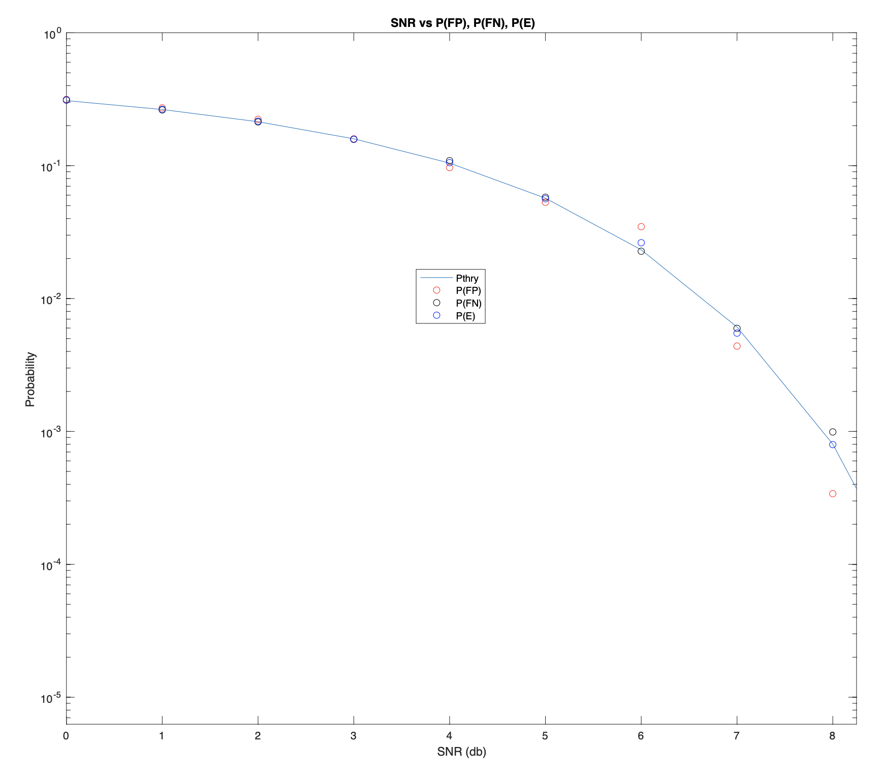

# Statistical Inference

The matlab scripts in this repository were part of assignments from EECE 5612 Statistical Inference Spring 2022 with [Dr. Milica Stojanovic](https://coe.northeastern.edu/people/stojanovic-milica/). The overall goal of these programs are to extract information from noisy signals, and classify data
using various decision rules and hypothesis testing. 

### HW1

This script simulates the signal absent or present  in gaussian noise scenario, where the ML (Maximum Likelihood) decision rule is used to determine if the given observation is noise or a signal based on the known SNR (signal to noise ratio). 10,000 trials were run for 16 SNR values ranging from 0 to 15 and the truth labels were used to calculate the probability of error, false positive, and false negative. The plot below confirms that a higher SNR yields a lower probability of error.

### HW2

This assignment builds on the signal absent or present scenario from HW1. First, the signal is known to be not constant but instead a random gaussian variable. Next, the signal is again constant but the noise is laplacian instead of gaussian. Finally, the prior probabilities of the signal being absent or present are given and used to make a MAP (Maximum A Priori) decision. 

### HW3

### HW4

### HW6

### HW6a

### HW7

### HW8

### HW9